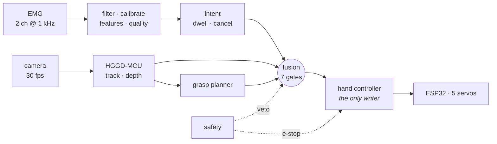

# NeuroGrip

**A shared-control software stack for an AI-assisted, tendon-driven robotic
prosthetic hand.**

```
       EMG  ──▶  intent  ──┐
                           ├──▶  fusion  ──▶  motion  ──▶  five tendon-driven fingers
    camera  ──▶  grasp  ───┘
                plan
```

> ⚠️ **Research prototype. Not a medical device.** Not evaluated or approved by
> any regulatory body. See [`docs/safety.md`](docs/safety.md).

---

## The rule

> **The AI never replaces the user. The user is always in control.**
>
> The AI only assists after understanding both what the user intends (EMG) and
> what they are interacting with (camera). The user decides **when**. The AI
> decides **how**.

This is not a slogan in a README — it is enforced structurally:

- [`DecisionFusion`](src/neurogrip/fusion/fusion.py) **cannot** emit a motion
  decision without a fresh, confident, motion-requesting intent from the user.
  The grasp planner is not even called until that gate has been passed.
- [`HandController`](src/neurogrip/control/controller.py) is the **only**
  component that writes to the actuators, so every limit has exactly one place
  to be enforced and nothing can bypass it.
- Every failure in the assistive path — no camera, stale vision, missing model,
  unconfident planner, planner exception — degrades to **direct user control**,
  never to a hand that will not move.

All three are tested, not asserted:
[`TestTheAiNeverActsAlone`](tests/unit/test_fusion_and_safety.py),
[`TestSharedControlInvariants`](tests/integration/test_system.py), and the
`no-intent-no-motion` scenario.

---

## Try it in 30 seconds

No hardware, no dependencies beyond Python 3.11:

```bash
git clone https://github.com/JustAdev742/Project-NeuroGrip--BetaTouch-inc.git
cd Project-NeuroGrip--BetaTouch-inc

# Run five scenarios against the fully simulated hand
PYTHONPATH=src python3 -m neurogrip simulate all
```

```
grasp-bottle: PASS (8.0 s)
  ✓ hand is holding the object (contacts: 5)
  ✓ AI selected a grasp (cylindrical)
  ✓ grip force 0.65 within the ceiling
no-intent-no-motion: PASS (6.0 s)
  ✓ hand did not move without user intent (max travel 0.000)
  ✓ the camera did see the object (so inaction was a decision, not blindness)
user-cancel: PASS (6.0 s)
vision-lost: PASS (6.0 s)
fragile-object: PASS (7.0 s)

5/5 scenarios passed
```

Then watch the interface, live, in your terminal:

```bash
PYTHONPATH=src python3 -m neurogrip run --profile simulation --duration 20
```

The core runtime is **standard library only**. NumPy, OpenCV, ONNX Runtime and
pyserial are optional extras behind guarded imports, so the whole stack runs and
is tested with no install step.

---

## The system



| Subsystem | What it does |
|---|---|
| [`core`](src/neurogrip/core) | Types, clock, events, config, DI, lifecycle. No domain knowledge. |
| [`hal`](src/neurogrip/hal) | Every device behind a `Protocol`. No pin number escapes this package. |
| [`emg`](src/neurogrip/emg) | Filters, calibration, features, quality → `IntentEstimate`. |
| [`vision`](src/neurogrip/vision) | Swappable backends → `VisionResult`. Ships **HGGD-MCU**. |
| [`ai`](src/neurogrip/ai) | Affordance database + grasp-planner chain. Decides *how*, never *whether*. |
| [`fusion`](src/neurogrip/fusion) | Seven ordered gates combining intent, perception, mode and safety. |
| [`control`](src/neurogrip/control) | Trajectories, limits, adaptive grip force, kinematics. |
| [`safety`](src/neurogrip/safety) | Watchdogs, rules, latching e-stop. |
| [`modes`](src/neurogrip/modes) | Manual · AI Assist · Sports · Training — parameter bundles, not control paths. |
| [`training`](src/neurogrip/training) | Five exercises, adaptive difficulty, progress, achievements. |
| [`ui`](src/neurogrip/ui) | Declarative screens; Tk, text or headless renderers. |
| [`diagnostics`](src/neurogrip/diagnostics) | Health, metrics, self-tests, debug console. |
| [`runtime`](src/neurogrip/runtime) | Rate-group scheduler and the composition root. |

---

## Operating modes

| Mode | AI | Force | Speed | For |
|---|---|---|---|---|
| **Manual** | **off** | 0.70 | 1.0× | Learning, diagnostics, calibration, and any moment you want the hand to do exactly and only what you tell it. The camera is not merely ignored — it is not run. |
| **AI Assist** | on | 0.75 | 1.0× | The primary mode. Point, contract, and the hand chooses a grip that suits what it sees. |
| **Sports** | on | 0.80 | 1.6× | Reaction speed. Shorter dwell, no jerk limiting, faster loops. Still requires intent for every action. |
| **Training** | **off** | 0.50 | 1.0× | Exercises and games. Assistance is off, because an exercise that measures you while an AI corrects you measures nothing. |

A mode is a `FusionPolicy` + `MotionLimits` + `IntentSettings` + presentation
flags. **A new mode cannot introduce a new way for the hand to move**, and
therefore cannot introduce a new way to move it unsafely.

---

## The AI Assist loop

```
camera sees an object, continuously
        │
        ▼
EMG detects the user's intention to grasp        ◀── nothing happens before this
        │
        ▼
only now is the grasp planner consulted
        │
        ▼
HGGD-MCU grasp → affordance check → force ceiling → hand configuration
        │
        ▼
motion, scaled by the user's own muscle effort
        │
        ▼
co-contract to cancel, at any moment
```

Perception runs continuously so a plan is *ready*. A plan is never *executed*
without intent. Those are separate steps on purpose.

---

## Vision: HGGD-MCU

The configured backend is **HGGD-MCU** — the edge profile of *Heatmap-Guided 6-DoF
Grasp Detection* (Chen et al., RA-L 2023). It predicts a dense graspability
heatmap plus per-anchor angle, width and quality, which answers "where on this
object would a grasp work?" directly instead of making us infer it from a box.

- Decoding (peak finding, sub-cell refinement, angle decode, grasp NMS) is
  independent of the inference runtime and unit-tested against hand-built tensors.
- Runtimes: ONNX Runtime, TFLite, or — with no weights present — a **classical
  edge-density graspability session** that emits the same tensor layout. That is
  a real (if modest) baseline, not a stub, and it is what keeps the system usable
  when the model file is missing.
- Backends are swappable by configuration and declare capability flags. A
  detection-only backend simply omits `GRASP`, and the affordance planner takes
  over.

See [`docs/vision.md`](docs/vision.md).

---

## Command line

```bash
neurogrip run          # start the system
neurogrip simulate     # run scenarios against simulated hardware
neurogrip diagnose     # self-tests and a health report
neurogrip calibrate    # the guided EMG calibration wizard
neurogrip train        # a training exercise in the terminal
neurogrip record       # capture raw EMG to a file
neurogrip replay       # replay a recording through the live pipeline
neurogrip console      # interactive debug console
neurogrip config       # print the merged configuration
neurogrip info         # system and hardware information
```

Every subcommand takes `--config`, `--profile`, `--set key=value` and
`--log-level`.

---

## Hardware

| Part | Reference build |
|---|---|
| Host | Raspberry Pi 4B / CM4, 64-bit Linux |
| Actuators | 5 × metal-gear micro servo, tendon-driven with high-strength fishing line |
| Motor controller | ESP32-S3, NGP v1 over USB-CDC at 921600 baud |
| EMG | 2-channel differential front end (flexor + extensor) → 24-bit ADC → 1 kHz |
| Camera | Pi Camera Module 3 or any V4L2 device |
| Display | 800×480 capacitive touchscreen |

Firmware lives in [`firmware/esp32_motor_controller`](firmware/esp32_motor_controller).
The wire protocol is documented in [`docs/protocol.md`](docs/protocol.md) and is
byte-for-byte shared between `ngp_protocol.h` and `hal/protocol.py`.

**Swapping hardware** means implementing one `Protocol` and adding a branch to
`HardwareFactory`. Nothing above the HAL changes.

---

## Development

```bash
python3 -m venv .venv && source .venv/bin/activate
pip install -e ".[dev]"

pytest                                  # everything
pytest tests/unit -q                    # fast: no I/O, no sleeping
pytest tests/integration -q             # the whole system, simulated
ruff check src tests
mypy src
```

Tests never sleep. Every component takes a `Clock`, so the integration suite
drives the entire application — real filters, real fusion gates, real ESP32
driver over the real protocol against an in-process firmware emulator — under a
`SimulatedClock`, far faster than real time.

---

## Documentation

| | |
|---|---|
| [architecture.md](docs/architecture.md) | Layers, invariants, runtime model, and why each decision was made |
| [safety.md](docs/safety.md) | The hazard analysis, the response ladder, and an honest list of this design's limits |
| [fusion.md](docs/fusion.md) | The seven gates, walked through one at a time |
| [emg.md](docs/emg.md) | Signal chain, calibration, intent, recording and replay |
| [vision.md](docs/vision.md) | Backends, HGGD-MCU, tracking, depth |
| [modes.md](docs/modes.md) | What actually differs between the four modes |
| [hardware.md](docs/hardware.md) | Bill of materials, wiring, assembly, tuning |
| [protocol.md](docs/protocol.md) | NGP v1 wire format |
| [configuration.md](docs/configuration.md) | Every setting, and the layering rules |
| [training.md](docs/training.md) | The exercises and what each one trains |
| [development.md](docs/development.md) | Conventions, testing strategy, how to extend |

---

## Status

Everything described here runs. The simulation harness exercises the complete
stack end to end, and the test suite covers the safety invariants explicitly.

Not yet done, and marked `TODO` in the code where relevant:

- **No trained HGGD-MCU weights ship** — a model file is a separate artefact. The
  classical fallback runs in its place and says so on the diagnostics screen.
- **No per-user gesture model** — the threshold classifier is the default and
  needs no training data. `tools/` for collecting labelled windows is sketched
  but not built.
- **Firmware update transport is not implemented** — the UI flow exists so it can
  be designed and reviewed before any code can install anything onto a worn device.
- **Grip force is estimated from motor current**, not measured. The
  current-to-force constant is nominal.
- **No independent hardware safety channel.** The e-stop is software on the same
  MCU as the drive. A certifiable device needs a contactor with no software in
  the path.

The last two are where anyone taking this further should start.

## Licence

MIT — see [LICENSE](LICENSE). Not a medical device.
