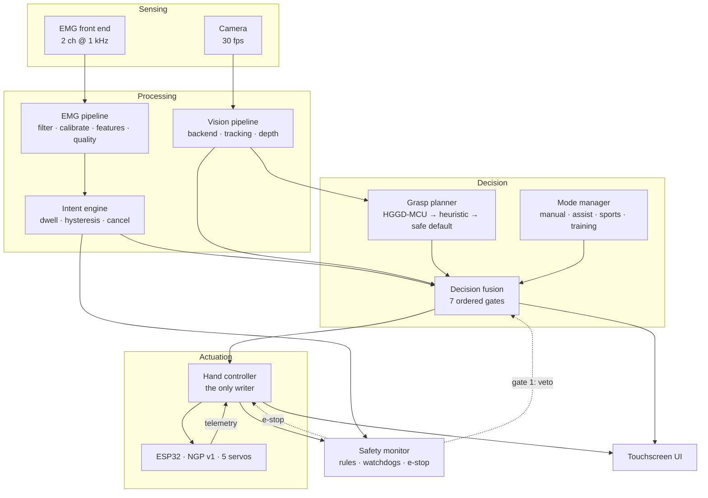

# Architecture

## The rule everything else follows

> **The AI never replaces the user. The user is always in control.**
>
> The AI only assists after understanding both what the user intends (EMG) and
> what they are interacting with (camera). It decides *how*, never *whether*.

That is a design constraint, not a slogan, and this document explains how it is
enforced structurally rather than by convention.

Three invariants carry it:

1. **One writer.** [`HandController`](../src/neurogrip/control/controller.py) is
   the only component that writes to the servo bus. There is no other path to the
   actuators, so limits, emergency stop and cancellation each need exactly one
   implementation that nothing can bypass.
2. **One gate.** [`DecisionFusion`](../src/neurogrip/fusion/fusion.py) cannot emit
   a motion decision without a fresh, confident, motion-requesting intent from the
   user. Vision and the grasp planner are only consulted *after* that gate has
   been passed.
3. **Failure degrades to control, never to inaction.** Every failure in the
   assistive path — no camera, stale vision, unloadable model, unconfident
   planner, planner exception — falls through to direct proportional control. A
   hand that stops working because a model failed to load would be a worse
   outcome than a hand with no model at all.

These are tested, not merely asserted:
[`tests/unit/test_fusion_and_safety.py::TestTheAiNeverActsAlone`](../tests/unit/test_fusion_and_safety.py)
and
[`tests/integration/test_system.py::TestSharedControlInvariants`](../tests/integration/test_system.py).

---

## System overview



Note the direction of the safety arrows: safety can only ever *remove*
capability. There is no path by which it grants any.

---

## Layers

The dependency graph is acyclic and points inwards. `core` knows nothing about
the domain; `hal` knows nothing about decisions; `fusion` knows nothing about
hardware.

| Layer | Package | Knows about | Never knows about |
|---|---|---|---|
| Framework | `core` | types, time, events, config, lifecycle | anything domain-specific |
| Hardware | `hal` | drivers, wire protocols, pins | intent, grasps, modes |
| Signals | `emg` | filtering, calibration, intent | actuators, vision |
| Perception | `vision` | models, tracking, depth | intent, actuators |
| Reasoning | `ai` | affordances, grasp planning | actuators, timing |
| Arbitration | `fusion` | combining evidence, policy | how to move |
| Motion | `control` | trajectories, limits, force | why it is moving |
| Supervision | `safety` | rules, watchdogs, e-stop | — (reads everything) |
| Behaviour | `modes` | parameter bundles | new ways to move |
| Learning | `training` | exercises, progress | — |
| Presentation | `ui` | screens, rendering | how anything works |
| Assembly | `runtime` | wiring everything | — |

### `core` — framework primitives

No domain knowledge. Provides the vocabulary (`HandPose`, `GraspType`,
`IntentKind`), the plumbing (`EventBus`, `Config`, `Container`, `Service`) and
the temporal substrate (`Clock`, `RateTimer`).

**Every component receives a `Clock`.** Nothing calls `time.monotonic()`
directly. That is what makes watchdog expiry, debounce windows, motion profiles
and staleness decay testable exactly, and lets a whole grasp sequence replay in
microseconds.

### `hal` — hardware abstraction

**No vendor library, file descriptor or pin number appears outside this package.**
Every peripheral is reached through a `Protocol`; `HardwareFactory` is the single
place mapping configuration onto concrete drivers.

The consequence that pays for the abstraction: the *production* ESP32 driver and
the *real* wire protocol run against an in-process firmware emulator, so framing,
CRC, sequencing and the firmware watchdog are all genuinely exercised in CI.

### `emg` → `IntentEstimate`

```
raw volts → DC block → 50/60 Hz notch → 20–400 Hz band-pass → rectify → envelope
          → normalise (calibration) → features → quality
          → gesture classification → dwell/hysteresis → IntentEstimate
```

Nothing downstream sees microvolts. See [emg.md](emg.md).

### `vision` → `VisionResult`

Backends are swappable and declare capability flags. The configured backend is
**HGGD-MCU**; a plain ONNX detector, a mock and a null backend also ship. See
[vision.md](vision.md).

### `ai` — how, never whether

Deliberately narrow: an affordance database and a grasp-planner chain. No
actuator access, no timer, no way to initiate anything.

### `fusion` — the heart

Seven ordered gates, each of which can only reduce what the system may do. See
[fusion.md](fusion.md).

### `control` — the only writer

`HandController` owns the actuators. `MotionQueue` arbitrates by priority,
`TrajectoryGenerator` produces synchronised limit-respecting motion,
`AdaptiveGripController` detects contact from motor current, `HandKinematics`
enforces mechanical and self-collision limits.

### `safety` — supervision

Watchdogs (*is everything still running?*), rules (*is everything within
limits?*), and a monitor that folds both into one verdict. See [safety.md](safety.md).

### `modes` — parameter bundles, not control paths

All four modes run the identical pipeline. A mode is a `FusionPolicy` plus
`MotionLimits` plus `IntentSettings` plus presentation flags — so **a new mode
cannot introduce a new way for the hand to move**, and therefore cannot introduce
a new way to move it unsafely. See [modes.md](modes.md).

---

## Runtime model

**One thread.** Every periodic task is a rate group on a cooperative scheduler.

| Group | Rate | Work |
|---|---|---|
| `control` | 200 Hz | read telemetry, step trajectory, write targets |
| `emg` | 200 Hz | drain samples, filter, classify, estimate intent |
| `decision` | 100 Hz | evaluate safety, run the mode, fuse |
| `vision` | 20 Hz | capture and inference |
| `ui` | 15 Hz | assemble the view model, render |
| `diagnostics` | 2 Hz | health, metrics, resources |

Single-threading is a deliberate trade for a safety-relevant system: no data
races between the control loop and the UI, no lock ordering to get wrong, no
priority inversion. The cost — a slow task delays the others — is *measured*
(`LoopMonitor` reports period, jitter and overruns) rather than hidden, and the
control watchdog catches it.

Work that genuinely cannot be bounded (disk writes, telemetry) runs on a
`QueuedSubscriber` worker thread instead.

---

## Architectural decisions

### Why TOML rather than YAML

`tomllib` is in the standard library, so the target device needs no dependency to
read its own configuration. TOML also has an unambiguous type system and cannot
express the implicit conversions that make YAML a source of field faults (`no`
becoming `False`, `1.0.0` becoming a string only sometimes).

### Why a dependency-free core

The entire runtime core is standard library only. NumPy, OpenCV, ONNX Runtime and
pyserial live behind optional extras and guarded imports. That means:

- CI runs the full stack with no install step;
- a target device can boot and report *why* a dependency is missing rather than
  failing to import;
- the control loop's latency has no hidden vectorisation cliffs.

Filters are sample-at-a-time and allocation-free. At 1 kHz × 2 channels this is
well under 1 % of a Cortex-A72 core.

### Why host-side trajectory generation

A motion must be interruptible at any instant. If the ESP32 executed stored
profiles, a cancel would wait for a round trip; here the next control cycle
simply emits a different setpoint, so an abort takes effect within one 5 ms tick.

### Why the firmware owns its own watchdog

Safety must not depend on the Linux side being alive. Every `SET_TARGETS`
refreshes a firmware timeout; if the host crashes, is unplugged, or stalls in the
kernel, the firmware safes the actuators by itself. The host-side watchdogs are a
second, independent layer — not the only one.

### Why the classifier is threshold-based by default

For a device someone depends on, a classifier whose behaviour can be predicted,
explained on screen and reproduced exactly is worth more than a few points of
offline accuracy. It also needs no training data, so a new user is running after
a 20-second calibration. `LinearGestureClassifier` is the hook for
pattern-recognition control once per-user data exists.

### Why decisions carry `reasons`

A shared-control device must be able to explain itself. The dashboard renders the
reasons verbatim, and the black-box recorder stores them with the decision. When
a user says "it moved when I didn't mean it to", the answer is already written
down. Without that, every such report is unfalsifiable — not an acceptable
position for a device someone wears.

### Why the UI is declarative

Screens are pure functions from a view model to a widget tree; renderers turn
that into pixels or characters. The interface therefore renders into a *string*,
which is how `tests/unit/test_modes_training_ui.py` can assert that Manual Mode
shows the "AI DISABLED" banner without a display attached.

---

## Extending the system

| To add… | Do this | Nothing else changes |
|---|---|---|
| A vision model | implement `VisionBackend`, call `register_backend` | pipeline, fusion, UI |
| A grasp planner | implement `GraspPlanner`, add to `[ai] planners` | fusion, control |
| A servo bus | implement `ServoBus`, add a branch to `HardwareFactory` | everything above the HAL |
| An EMG front end | implement `EmgSource` | the whole EMG pipeline |
| An object class | add a table to `config/affordances.toml` | no code |
| A grip | add a table to `config/grasps.toml` | no code |
| An operating mode | define a `ModeProfile`, register it | fusion, control, safety |
| A safety rule | implement `SafetyRule`, add it to the monitor | everything else |
| A training exercise | implement `Exercise`, add it to `EXERCISES` | session, stats, UI |
| A UI screen | write a `ViewModel → Scene` function, add a route | renderers |

---

## What is deliberately *not* here

- **Autonomy.** There is no path from perception to motion. By construction.
- **Cloud dependency.** Everything runs on the device. A prosthesis that needs a
  network is a prosthesis that stops working on a train.
- **Silent adaptation.** Auto-recalibration only ever adjusts the *rest
  baseline*, never the effort needed to trigger a grasp. Changing that without
  the user's knowledge would be a safety change made behind their back.
- **Achievements that gate features.** The hand is fully capable from the first
  minute; the training system motivates, it does not unlock.
