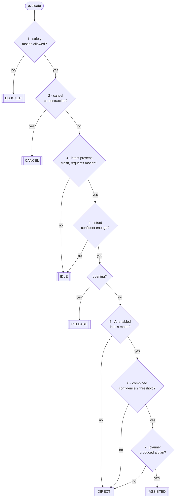

# Decision fusion

The module that decides, once per control cycle, what should happen. It is the
most safety-relevant code in the stack and is written to be read: the whole of
`DecisionFusion.evaluate` is a sequence of explicit, ordered gates, each of which
can only ever **reduce** what the system is allowed to do.

## The gates



Note where gates 5, 6 and 7 fall through: **`DIRECT`**, not `IDLE`. The failure
of assistance is never allowed to become the failure of the hand.

---

## Gate 1 — safety

`SafetyMonitor` has already run this cycle. If it says motion is not allowed,
nothing else is considered, and the safety layer's own explanation is passed
through verbatim so the user sees the actual reason rather than a generic
message.

Nothing overrides this gate. Not user intent, not a confident plan.

## Gate 2 — cancel

Checked **before** intent freshness and before the confidence gate, because an
abort must work even when it is the only thing the EMG system has managed to
produce. Co-contraction is a deliberate, unmistakable gesture, and the intent
engine gives it a much shorter dwell (40 ms rather than 120 ms).

`CANCEL` stops motion and **holds position** rather than opening. If the user is
holding a cup and aborts, dropping it would be worse than stopping where they are.

## Gate 3 — intent presence

**This is the gate that makes the system a shared-control device.**

```python
if intent is None:                                 return IDLE
if not intent.is_fresh(now, policy.max_intent_age_s): return IDLE
if not intent.requests_motion:                     return IDLE
```

There is no branch below this point reachable without a fresh, motion-requesting
intent from the user. The grasp planner is not called until gate 7 — so a
confident detection of a bottle, with a confident grasp available, produces
exactly nothing until the user's muscles ask for it.

The staleness check matters as much as the presence check: if EMG stops arriving
mid-motion, the hand must stop, not continue on the last command it saw.

One exception, and it is a hold rather than a motion: an intent of `REST` while
already holding an object maintains the grip. Releasing must be a deliberate act,
not what happens when you relax.

## Gate 4 — intent confidence

Below the mode's threshold, no motion. Confidence already folds in signal
quality, dwell satisfaction and classifier margin, so this is one honest number
rather than three separate checks.

## Opening is always direct

Nothing about opening the hand benefits from a grasp plan, and making *release*
depend on the AI would be a poor failure mode. `OPEN` short-circuits to
`RELEASE` before the AI gates are reached.

## Gate 5 — mode policy

Manual and Training set `ai_enabled = False`, so they take the `DIRECT` path.
This is not a special-case branch bolted on for Manual Mode — it is the same code
path the assisted modes fall through to when their evidence is weak, which is why
the two cannot drift apart.

## Gate 6 — combined evidence

```
combined = (intent_conf × w_emg + vision_conf × w_vision) / (w_emg + w_vision)
           + stability_bonus × track_stability
```

with one important special case:

```python
if vision_confidence <= 0.0:
    return intent_confidence   # renormalised, not penalised
```

Missing vision must not make the user's own clearly-expressed intent count for
less. The alternative — averaging a confident intent against a zero — would make
the hand *harder* to use precisely when its camera had failed.

Weights per mode: AI Assist 0.60/0.40, Sports 0.75/0.25 (vision is the slow
input, and Sports Mode is about reaction time).

## Gate 7 — the plan

The planner chain is consulted. It always returns *something* — the composite's
floor is a slow, gentle power grip — so this gate normally passes. When it does
not (a planner raised, or every plan fell below the confidence floor), the
decision falls through to `DIRECT`.

Plans are **held** for `plan_hold_s` (0.6 s in AI Assist, 0.3 s in Sports) so the
hand does not change its mind mid-reach as the classifier flickers.

---

## Evidence and explanation

Every decision carries:

- `reasons` — plain-language lines the dashboard renders verbatim;
- `evidence` — every input as a timestamped, weighted `Evidence` record, with
  confidence that decays continuously with age.

Evidence is collected **before** the gates run, so it is attached even to a
decision that short-circuits at gate 1. The diagnostics screen and the incident
recorder need to show *what the system knew* at the moment it decided, not just
what it decided.

That is what makes "why did it do that?" an answerable question after the fact.
Without it, every such report is unfalsifiable.

---

## Policy tuning

Thresholds live in `FusionPolicy`, one per mode, overridable from
`[fusion.<mode>]`. Two rules constrain what an override can do:

1. **Every threshold has a safe direction.** Higher thresholds mean less AI
   involvement and more direct user control. There is no value that can be raised
   to make the hand act more autonomously.
2. **Overrides are clamped.** Configuration may make the device *more*
   conservative, never less: force ceilings can only be lowered, confidence
   floors only raised, and `ai_enabled` cannot be turned on for a mode whose
   built-in policy disables it. Manual Mode means manual.

The structural gate (gate 3) is not a threshold and cannot be tuned away.

---

## Tests

`tests/unit/test_fusion_and_safety.py`:

- `TestTheAiNeverActsAlone` — the central rule, one test per way of violating it.
- `TestAssistanceDegradesToControlNeverToInaction` — the other half: no vision,
  stale vision, safety-suspended AI, and a planner that raises all still move the
  hand.
- `TestFusionPolicy` — including that configuration cannot enable the AI in
  Manual Mode or raise a force ceiling.
